# 学会使用这17个车队行车记录仪平台,五分钟搞定车辆监控

管理一支车队最让人头疼的就是不知道司机在路上到底干了什么,事故发生后也说不清责任,保险理赔扯皮能拖好几个月。现在有一批专业的车队行车记录仪平台能帮你实时掌握车辆位置、监控驾驶行为、自动上传事故视频,有的还用AI技术提前预警危险驾驶。这些系统从基础的GPS追踪到高级的驾驶员评分,从单摄像头到360度全景覆盖,价格和功能差异都挺大。这篇文章整理了17个值得关注的车队行车记录仪和管理平台,帮你快速找到适合自己车队规模和预算的解决方案。

---

## **[SureCam](https://surecam.com)**

专为商业车队打造的AI驱动行车记录仪,配备实时GPS追踪和云端视频存储功能。

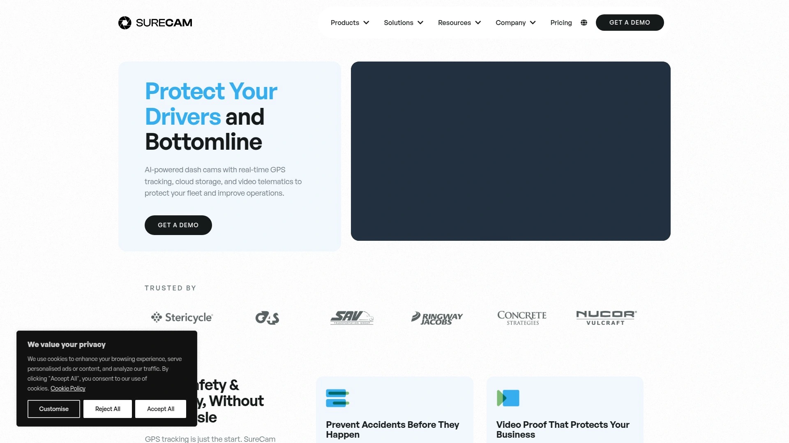

这个平台的核心优势是把复杂的功能做得很简单。不会像有些系统那样每天给你推送几百条没用的警报,SureCam用AI车内提示功能把警报量减少了90%,让司机在问题发生时就能自己纠正,只有真正重要的情况才会通知管理者。

**功能覆盖很全面:** 实时GPS追踪能让你随时知道每辆车在哪,手机或电脑都能看。想看某辆车现在路上什么情况?直接在后台点开实时视频流,不管你在办公室还是在外面。驾驶员ID系统会自动识别谁在开车,不需要手动登记,方便追踪每个司机的表现和问责。

驾驶员安全评分功能把数据变成可操作的信息,你能快速看到哪些司机表现好,哪些需要辅导,不用翻一堆报表。提供多种摄像头配置,从单纯的路面摄像头到双向、前后、以及适应恶劣环境的外置摄像头都有。

特别适合水暖、公用事业等需要可靠视频证据和实时洞察的行业。平台设计注重实用性,没有花里胡哨但用不上的功能,就是让车队管理变简单。

***

## **[Samsara](https://www.samsara.com)**

全套车队远程信息处理解决方案,包含AI行车记录仪、实时GPS追踪和ELD合规工具。

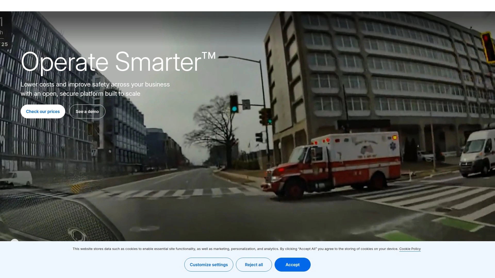

Samsara是市场上功能最全面的平台之一,特别适合大型车队。它的AI行车记录仪能检测分心、瞌睡和危险驾驶,实时发出车内音频警报并通知管理者立即辅导。

数据刷新是持续实时流式传输,这对需要实时运营监控的大车队很关键。配备开放API和应用市场,能跟ERP、调度、工资系统无缝集成。内置原生ELD支持,DVIR和合规工具都在一个平台里。

价格每车每月27-33美元,通常需要签1-3年合同。虽然不是最便宜的选择,但对于需要全套功能和实时可见性的大型车队来说物有所值。提供地理围栏、直升机视图、智能地图叠加、实时位置分享等高级GPS功能。

***

## **[Lytx](https://www.lytx.com)**

专注于长期安全改进的视频远程信息处理平台,通过行为评分和趋势分析帮助车队降低风险。

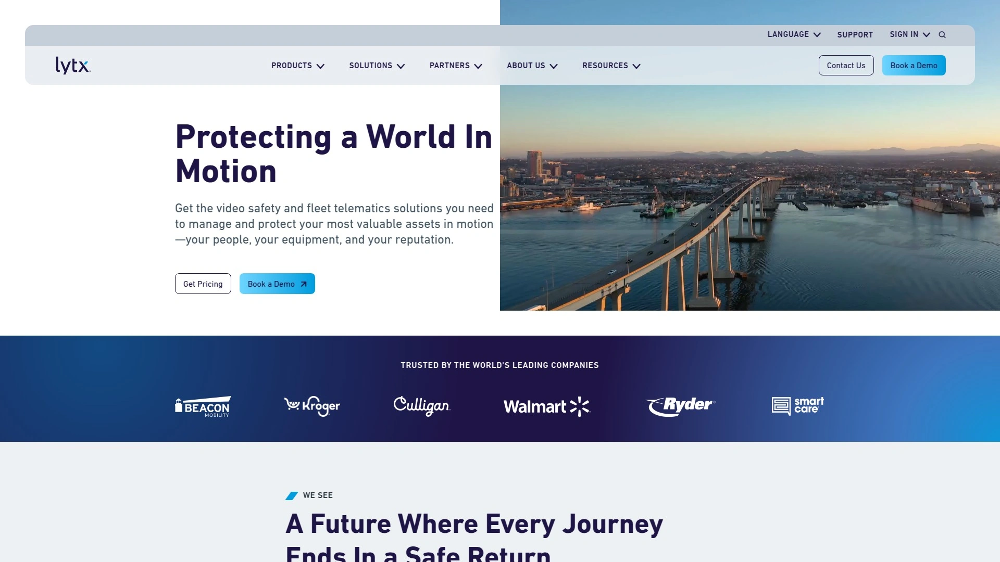

Lytx的特色是事件触发式视频上传,只在发生碰撞、急刹车等关键事件时上传。这种方式带宽效率高,但不支持连续流式传输。

系统重点放在驾驶员辅导计划上,通过长期的行为评分和趋势分析来改善表现。提供事件驱动的视频分析和辅导报告,帮助车队向保险公司展示主动的风险管理。

适合把安全放在第一位、愿意投入时间建立辅导体系的车队。定价通常每车每月40美元以上,配套视频安全包,经常需要长期协议。不提供原生ELD,需要对接第三方。

---

## **[Verizon Connect](https://www.verizonconnect.com)**

Verizon旗下的车队管理和GPS追踪解决方案,覆盖从小型企业到大型车队的各种需求。

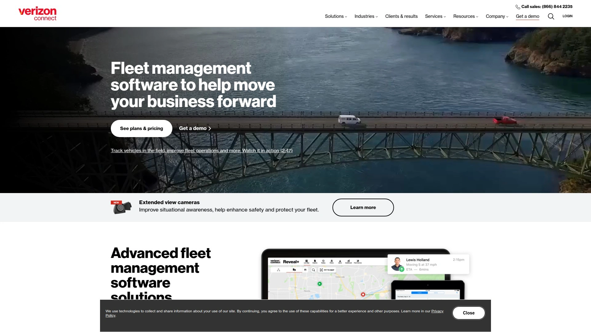

提供AI驱动的行车记录仪,配备实时警报、高清视频、驾驶员辅导和风险管理功能。GPS车队追踪软件能实时查看车辆位置、优化路线、监控驾驶员行为。

平台设计简洁,功能均衡,适合需要可靠但不复杂系统的中型车队。提供移动应用,让管理者在路上也能随时掌握车队动态。

跟Motive相比,Verizon Connect在品牌认知度和客户支持网络上有优势,但功能深度略逊一筹。适合重视供应商稳定性和长期支持的企业。

***

## **[GPS Insight](https://www.gpsinsight.com)**

模块化且性价比高的车队管理平台,只为你使用的功能付费。

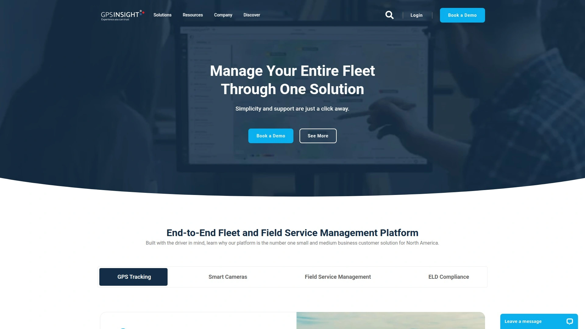

最大的优势是灵活性,可以根据车队需求配置数据刷新间隔,平衡可见性和成本。这对混合资产或预算有限的车队特别友好。

提供可选的AI行车记录仪,配置化的安全警报,双向摄像头可选。开放API便于与ERP、调度、工资系统无缝集成。内置原生ELD、DVIR和合规工具,全在一个平台。

合同灵活,支持月付和短期合同,适合需要扩展或试点的车队。最适合小到中型、混合资产车队,寻求灵活性和控制权的公司。能跟Fleetio这样的维护管理软件集成,自动推送里程表读数和故障码。

***

## **[Geotab](https://www.geotab.com)**

结合车载硬件和云端软件的全面车队远程信息处理系统。

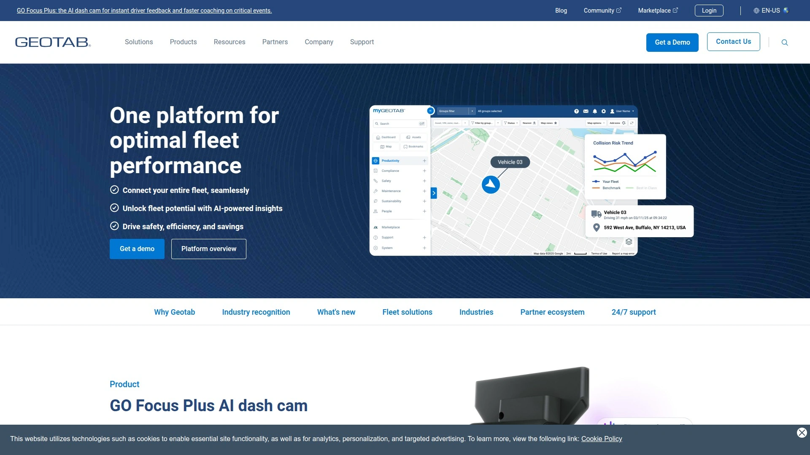

Geotab用GPS实时定位车辆,提供接近实时的车队可见性。收集燃油消耗、引擎健康、驾驶员行为等多种数据,帮你改进运营流程。

路线优化功能考虑交通、距离、燃油效率,帮你规划最优路线。驾驶员安全模块能监控驾驶行为,对超速、急刹车等不安全习惯设置警报。合规功能帮助车队遵守司机工作时间等法规要求。

提供车队行车记录仪解决方案,录制高清视频、改善车队安全、消除交通违规的猜测。服务全球数千支车队,技术成熟度高。适合需要深度数据分析和预测性维护的企业。

***

## **[Azuga](https://www.azuga.com)**

简单易用、价格实惠但功能强大的GPS车队追踪平台。

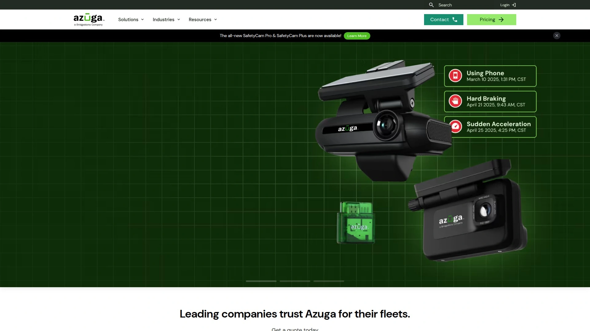

GPS追踪设备20秒就能安装好,即插即用,这对不想折腾复杂安装的车队来说特别方便。软件提供详尽报告,适合追踪各类资产包括车辆、设备等。

利用GPS追踪、车辆诊断和司机奖励功能,创建一个不仅完成任务、而且让每个人工作更轻松的系统。通过奖励和游戏化机制改善驾驶员安全,这种正向激励的做法在行业里比较独特。

从小企业到大型企业都能用,定价合理。提供远程信息处理导航、HVAC车队管理等行业特定解决方案。适合预算有限但想要全面功能的中小车队。

***

## **[Motive](https://gomotive.com)**

前身叫KeepTruckin,专注于自动化车队运营的一体化平台。

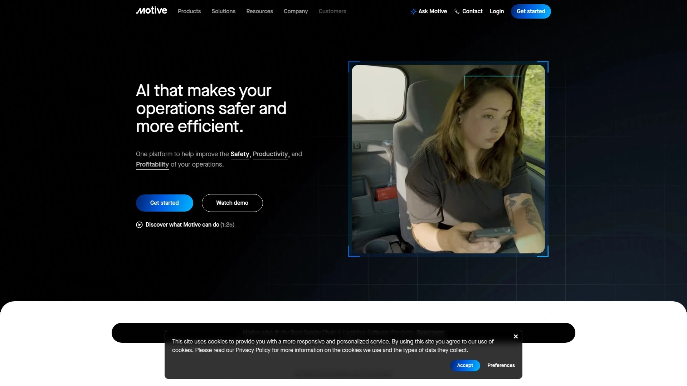

AI行车记录仪功能很强,能检测多种危险行为并实时警报。在跟Samsara和Lytx的对比中,Motive的优势是价格相对亲民且功能不打折扣。

特别适合卡车运输行业,ELD合规工具做得很到位。提供司机应用,让司机能方便地记录工作时间、完成车辆检查。

跟Verizon Connect相比,Motive在产品创新和用户体验上更胜一筹,界面更现代。适合中小型运输公司和需要强大ELD功能的车队。

***

## **[Fleetio](https://www.fleetio.com)**

顶尖的车队维护管理软件,简化各种规模车队的维护运营。

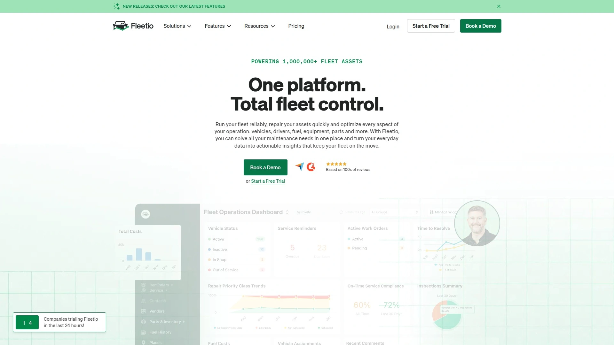

虽然Fleetio本身专注维护管理,但能跟GPS Insight、GPS Trackit等远程信息处理供应商集成。集成后能自动接收里程表读数和诊断故障码,不用手动从车到车去记录。

自动化的里程表更新确保基于里程的预防性维护准时完成。故障码自动从车辆发送到Fleetio,让管理层能及时发现"检查引擎灯"问题并决定是否需要维修。

特别适合维护工作繁重、需要精确追踪车辆健康状况的车队。跟远程信息处理平台的集成是免费的。适合已经使用GPS追踪但需要更好维护管理的车队。

***

## **[FleetOptix](https://fleetoptix.com)**

AI驱动的视频系统配合GPS追踪,为车队管理提供全方位监控。

系统充当你的眼睛和耳朵,捕获视频让你知道司机在干什么。集成AI摄像头用于车队管理,提供实时流媒体视频。

能识别不安全的驾驶行为来预防分心驾驶。GPS追踪功能报告急刹车、超速等不良事件并附带视频。事故发生后视频立即可用,作为无辜证明。

不需要签合同,灵活性高。行车记录仪应用让你完全掌握运营情况,点击按钮就能调取司机和车辆的媒体、查看位置、甚至实时流式传输行程。

---

## **[HD Fleet](https://hdfleet.com)**

配备GPS数据报告、超速/刹车警报和地理围栏功能的车队行车记录仪。

无论你是只有几辆车的小型配送公司,还是全国范围的大型车队,HD Fleet都能满足你行业的具体需求。提供720p/1080p高清录像,所有摄像头配备前向和司机侧视图,包含夜视功能。

移动应用配备分心驾驶检测改善安全、司机报告卡用于员工评估和辅导、地理围栏验证工作现场、云端存储最长3个月。

帮你减少车队成本,因为通过集中数据和预测性报告能主动最小化开支。GPS行车记录仪不仅帮你查明碰撞真相,还能节省时间和金钱,保护司机,提高驾驶效率。服务多个行业包括商业车队、救护车、废物管理、建筑公司。

---

## **[Matrack](https://matrackinc.com)**

多摄像头AI车队行车记录仪,最多支持5个摄像头实现360度覆盖。

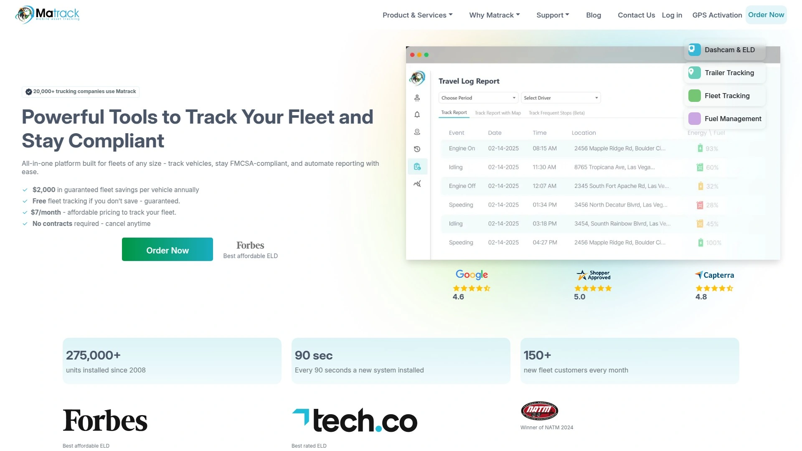

在测评中,Matrack的多视角设置对追踪路况和司机行为都很有用,让管理者能一致地评估表现并将驾驶习惯与路上事件关联起来。

AI功能在提高问责方面发挥重要作用,急刹车、瞌睡、使用手机等危险行为会实时标记,事件录像自动存储在云端,为培训和合规提供可靠证据。

按需调取视频简化了事故调查,节省了跨车辆对比事件的时间。唯一缺点是网络信号差的地区实时视频访问较慢。

价格从99美元起,配备AI驾驶员警报、按需视频访问、实时GPS追踪。提供免费一个月的NextGen行车记录仪。适合需要全面覆盖和AI安全功能的车队。

***

## **[Nexar](https://www.getnexar.com)**

商业车队行车记录仪解决方案,提供实时地理围栏和AI驱动的激进驾驶检测。

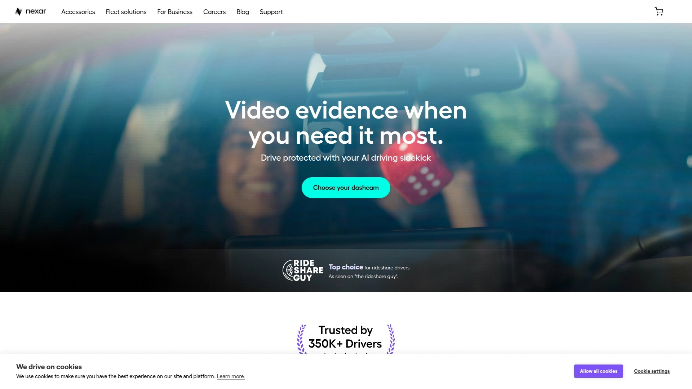

功能包括实时地理围栏、实时GPS追踪、实时视频监控、AI激进驾驶检测、远程实时流媒体。

特别适合需要实时监控能力的城市配送车队。移动优先的设计让管理者能在手机上轻松查看车队状态。

价格相对亲民,适合预算有限的小型车队。简单易用,不需要复杂的培训就能上手。

***

## **[Teletrac Navman](https://www.teletracnavman.com)**

全面的GPS车队追踪系统,提供丰富功能但学习曲线稍陡。

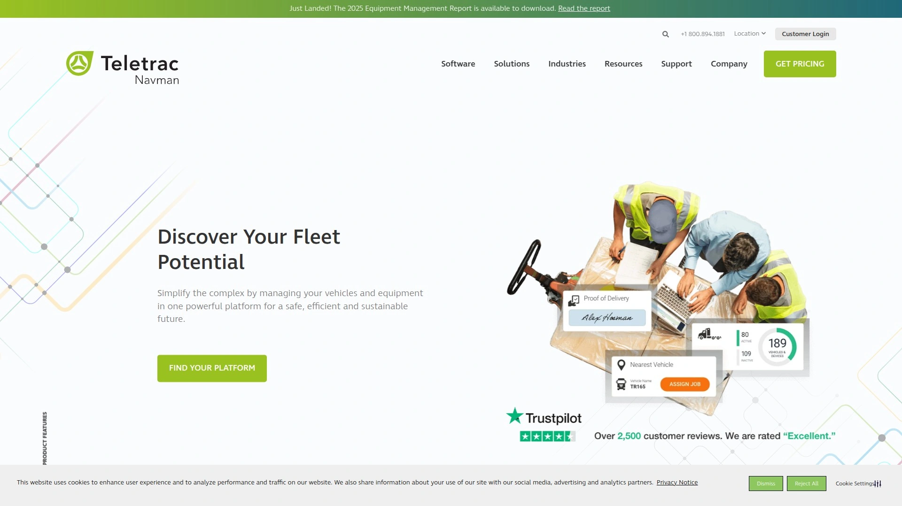

用户喜欢它的综合功能,包括GPS追踪、燃油管理、驾驶员行为监控。提供车队运营的实时洞察,帮企业优化路线、减少燃油消耗、改善驾驶员安全。

缺点是用户界面有点笨重,跟Samsara和Verizon Connect相比显得过时。某些功能比如报告和分析比较复杂,需要较长学习曲线。

尽管有这些缺点,Teletrac Navman因其可扩展性和可定制性仍然受大型多元化车队欢迎。能跟其他业务系统如工资和调度集成,这对很多用户是主要优势。最适合已建立的、有复杂车队管理需求的公司。

***

## **[Rhino Fleet Tracking](https://www.rhinofleettracking.com)**

完整的GPS车队追踪解决方案,在用户评价中获得"优秀"评级。

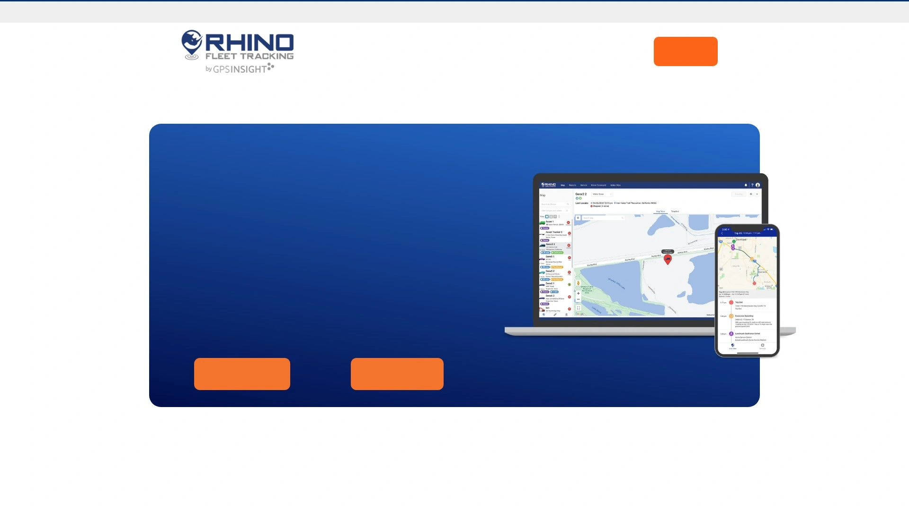

用户满意度很高,评分4.58/5,被58位用户评为优秀。相比之下Teletrac Navman只有2.81/5。

提供全面的车队追踪功能,界面友好,客户支持响应快。价格比一些大品牌更有竞争力。

适合中小型车队,特别是那些重视用户体验和客户服务的公司。功能虽然不如Samsara或Geotab那么深,但对大多数车队来说完全够用。

***

## **[Fleetcam](https://www.fleetcam.com)**

提供8摄像头支持和独特功能如WiFi云和面包屑图像的车队行车记录仪。

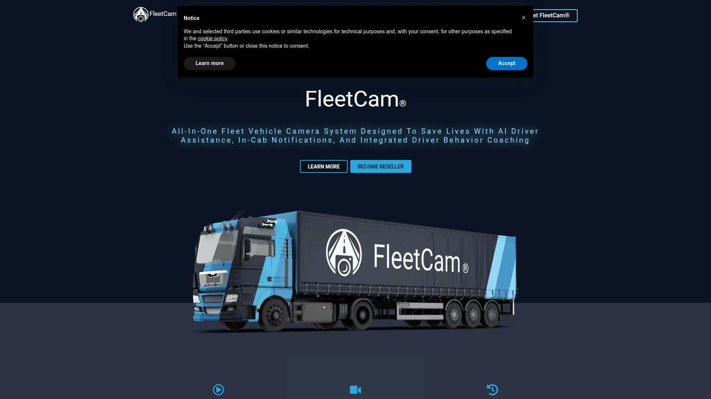

跟Samsara、Lytx、Nauto等竞争对手相比,Fleetcam在多个方面有优势。支持最多8个摄像头,覆盖范围比竞品更广。

提供实时和历史视频的即时远程访问,而有些竞争对手只能请求访问。车内反馈系统为每种反馈类型提供不同的语音命令,比单纯的哔哔声更清晰。

视觉LCD屏幕同时用于车内警报和倒车/侧摄像头,功能整合度高。提供礼宾服务帮你审查视频。能创建WiFi云和提供面包屑图像,这些是竞品没有的独特功能。

***

## **[BlackVue](https://www.blackvue.com)**

4K超高清行车记录仪品牌,适合追求视频清晰度的车队。

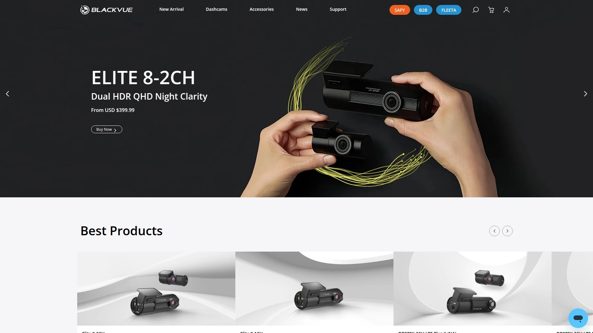

DR900X-2CH Plus型号提供4K前摄像头和STARVIS后置传感器,低光环境下也能清晰捕捉车牌。通过BlackVue应用访问系统流畅,视频检索速度快。

可选LTE模块支持远程实时视频查看,对长途车队路线很有帮助。停车模式带运动检测提供额外安全保护。

缺点是4K录制带来的文件很大,弱网络地区上传时间长,数据使用量增加快。价格460美元起,适合重视清晰度超过存储效率的车队。在消费级行车记录仪市场也很受欢迎。

***

## **[US Fleet Tracking](https://www.usfleettracking.com)**

提供免费GPS车队追踪硬件的平台,降低初始投入成本。

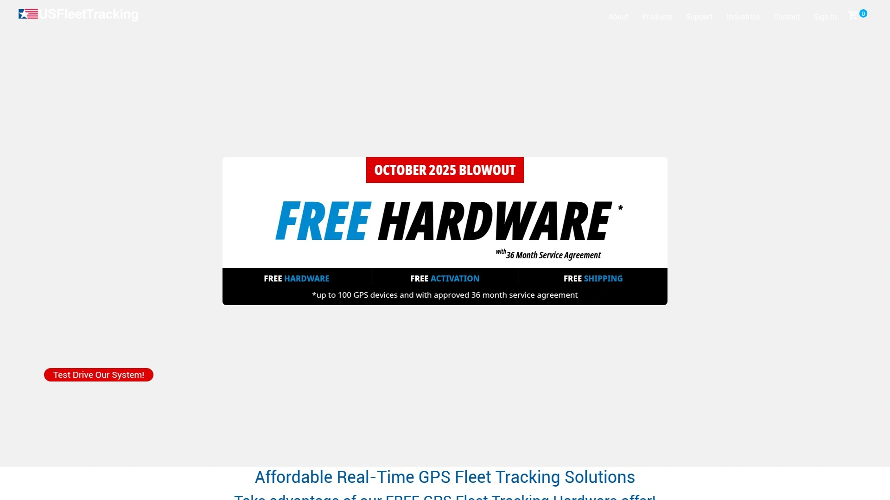

正在进行十月促销,提供免费硬件。30天无理由退货,试用风险低。

适合预算紧张但想尝试GPS追踪的小型车队。虽然硬件免费,但通常需要订阅软件服务。

功能可能不如Samsara或Geotab全面,但对基础追踪需求来说够用。适合初次接触车队管理系统的公司。

***

## 常见问题

**车队行车记录仪的AI功能真的有用吗?**

AI功能能实时识别分心驾驶、瞌睡、急刹车等危险行为,并在车内发出警报让司机自我纠正。像SureCam这样的系统能把无用警报减少90%,只通知管理者真正重要的情况。实测中AI检测确实能减少事故,特别是对长途驾驶和新手司机效果明显。但要注意AI需要正确校准,安装后要根据车队实际情况调整灵敏度,否则会误报或漏报。

**小型车队需要上这么复杂的系统吗?**

不一定需要最全功能的平台,但基础的GPS追踪和视频记录对任何规模车队都有价值。小车队可以从灵活合同、模块化定价的平台入手,比如GPS Insight或Azuga,只为需要的功能付费。事故时有视频证据能快速理清责任,这个投资回报率很高。US Fleet Tracking这种提供免费硬件的选项也能降低试用门槛。从基础开始,随着车队增长再扩展功能比较合理。

**这些平台的视频能保存多久?**

云端存储时长因平台和套餐而异,通常从30天到90天不等。像HD Fleet提供最长3个月云存储,Matrack和Fleetcam也提供云端长期存储。重要事件视频通常会被标记并永久保存或单独归档。如果你的行业有特殊合规要求需要更长保存期,选平台前要确认存储政策和额外费用。有些平台允许下载关键视频到本地备份。

***

## 总结

选对车队行车记录仪系统能让管理效率翻倍,从保险理赔到司机辅导都能少走很多弯路。不同平台各有侧重,有的主打AI智能、有的强调性价比、有的适合大型车队全面管理。如果你需要一个功能全面但不复杂、真正减少无用警报的解决方案,[SureCam](https://surecam.com)通过AI车内提示把警报量减少90%的做法特别适合想要实时监控但又不想被信息淹没的车队管理者,它把先进技术和简单易用结合得很好。
